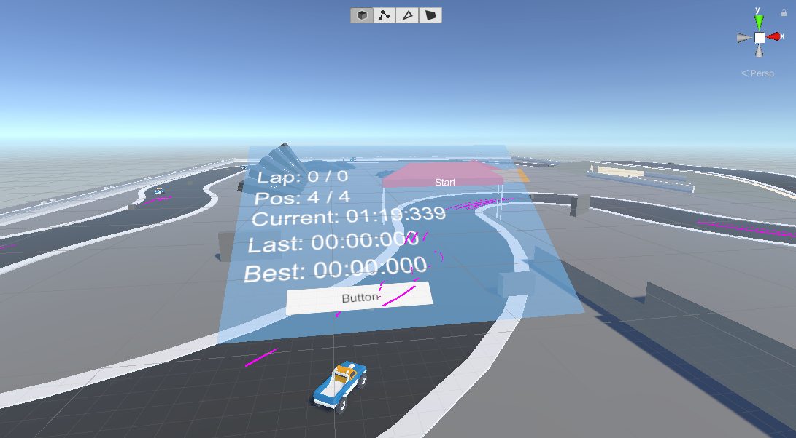
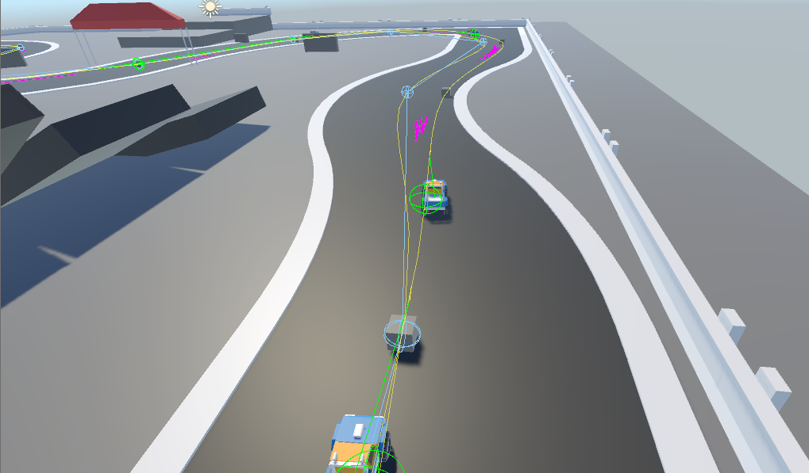

# VrMicroRacer

   
Race stats.
\
\
   
AI path implemented.   

\
\
This project was started to research the possibilities of creating an top-down racer in unity on oculus quest.
To see how much motion sickness there would be and also to investigate ideas etc.

Unity is setup to run on oculus quest and Android.

## Things to know
1. OVR is used for vr controls.
2. Unity standard asset car AI is used for cars.
3. Car models are from a free asset project in asset store.
4. Test Runner has been set up.

## Getting started developing
- Clone project.
- Do not be afraid to experiment. Have fun!
